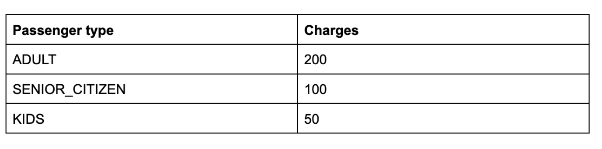
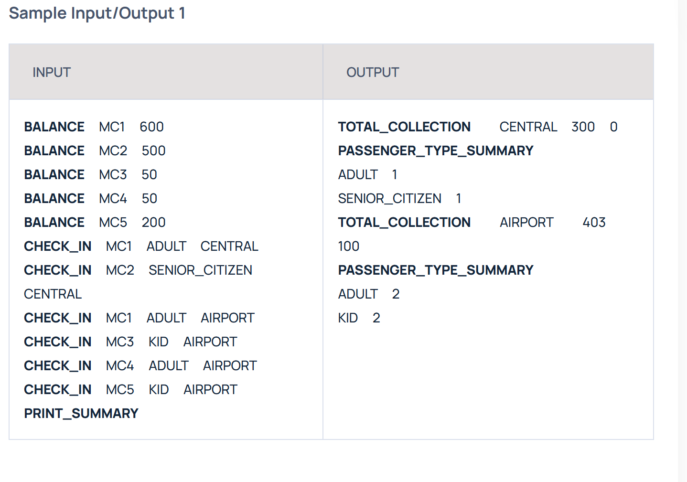

### Context
A new metro train has been launched from the Central station to the Airport. It is a non-stop train, which means the train will stop only at the Airport with no intermediate stops.
It is also possible to return from the Airport back to the Central station. This is also a non-stop journey.

### MetroCard
Metro authority prefers money to be collected via MetroCard. MetroCard is an electronic payment utility that can be used to pay for the metro travel charges. The MetroCard is like a wallet loaded with money. Each person traveling in this metro must carry a MetroCard and each card will have a unique number.

To travel by this train, one needs a MetroCard. If the MetroCard doesn’t have sufficient balance, then the remaining cost for the travel needs to be paid by recharging the MetroCard. This auto recharge loads only the required amount of money for the journey and the station collects a 2% service fee for the transaction.

### Travel charges
Costs for the journey are based on the passenger's age. It is categorized as below

### Journey Types
Travel charges are different for a single trip and for a return journey. When a passenger takes a return journey, there is a discount of 50% for the travel charges of the return journey.

For eg: If a senior citizen travels from Central to Airport, the travel charge collected is 100. If the same citizen travels back to Central station,  the amount collected for the return journey is 50. If the same citizen passes a third time on the same day, it will be treated as a new single journey and the travel charge collected is 100.

### Goal
Your task is to build a solution that calculates various travel charges collected at each station and print the collection summary and passenger summary.

The collection summary should give a breakup of the total amount collected and the total discount given.
The passenger summary should display the total number of passengers traveled per type in descending order of the passenger count.
If any of the passenger type have same value for passenger count then display in the ascending order of the passenger type for that case.
Ex:If ADULT and KID has same value then display it as
ADULT <no_of_passengers>
KID <no_of_passengers>

### Assumptions
- All passengers should have a MetroCard.
- If a passenger does not have sufficient balance in the MetroCard, then the MetroCard needs to be recharged before taking up the journey.
- The service fee for doing the recharge is collected by the origin station of the journey.
- The passenger count is calculated based on journeys eg: if the same passenger travels twice, the count is 2.

# Pre-requisites
* Java 1.8/1.11/1.15
* Maven

# How to run the code

We have provided scripts to execute the code. 

Use `run.sh` if you are Linux/Unix/macOS Operating systems and `run.bat` if you are on Windows.  Both the files run the commands silently and prints only output from the input file `sample_input/input1.txt`. You are supposed to add the input commands in the file from the appropriate problem statement. 

Internally both the scripts run the following commands 

 * `mvn clean install -DskipTests assembly:single -q` - This will create a jar file `geektrust.jar` in the `target` folder.
 * `java -jar target/geektrust.jar sample_input/input1.txt` - This will execute the jar file passing in the sample input file as the command line argument

 We expect your program to take the location to the text file as parameter. Input needs to be read from a text file, and output should be printed to the console. The text file will contain only commands in the format prescribed by the respective problem.

 Use the pom.xml provided along with this project. Please change the main class entry (`<mainClass>com.example.geektrust.Main</mainClass>`) in the pom.xml if your main class has changed.

 # Running the code for multiple test cases

 Please fill `input1.txt` and `input2.txt` with the input commands and use those files in `run.bat` or `run.sh`. Replace `java -jar target/geektrust.jar sample_input/input1.txt` with `java -jar target/geektrust.jar sample_input/input2.txt` to run the test case from the second file. 

 # How to execute the unit tests

 `mvn clean test` will execute the unit test cases.

# Help

You can refer our help documents [here](https://help.geektrust.com)
You can read build instructions [here](https://github.com/geektrust/coding-problem-artefacts/tree/master/Java)